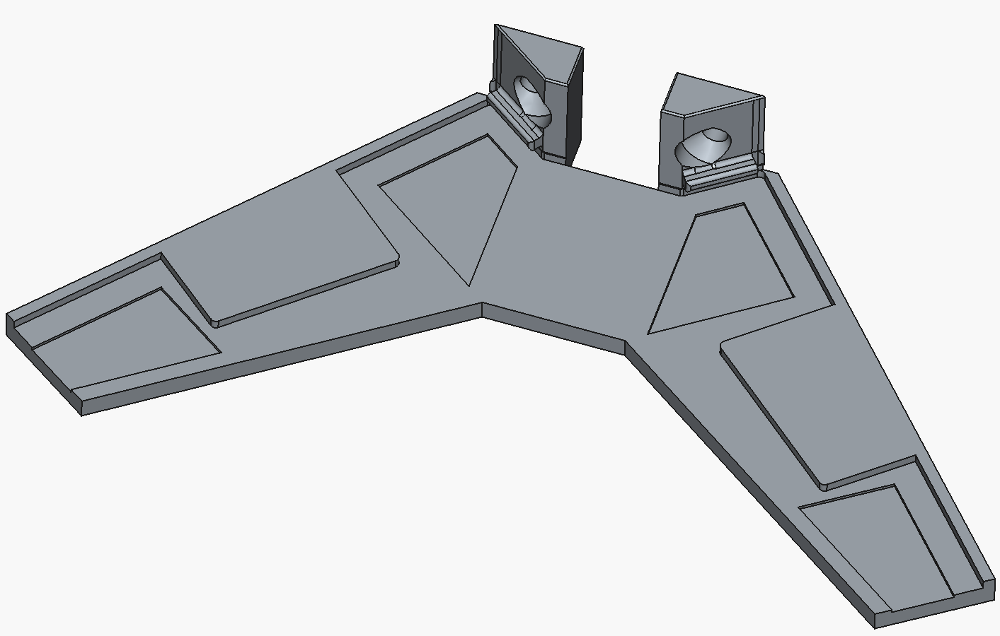

# Gamesir Cyclone 2 wall mount

Contains some [FreeCAD](https://www.freecad.org/) design and exported 3MF files
for printing a [Gamesir Cyclone 2](https://gamesir.com/products/gamesir-cyclone2-black)
wall-mount.

## Printing

I recommend printing in either white or black PLA, depending on your controller's colour.

I had good printing results with:

* 5 base layers
* 3 top layers
* concentric top/bottom layer pattern
* square infill pattern

## License

This project is proprietary: please open an issue if you'd like to use it, and I will
find an appropriate license to assign to it.

Also, AI usage is **NOT PERMITTED**.